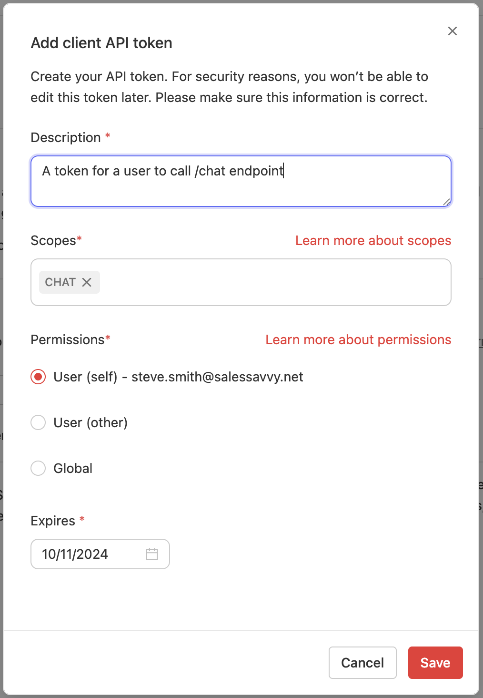
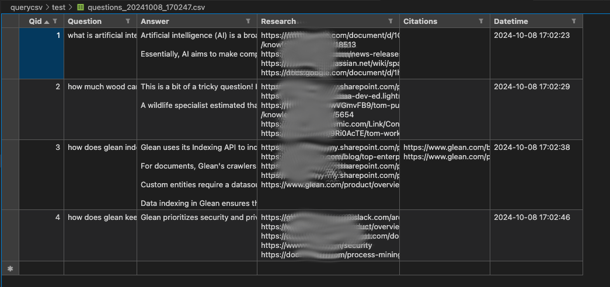

# LLM Query CSV for Answers

A Python-based tool that processes questions from a CSV file and uses LLM (Large Language Model) to generate answers, research, and citations. The tool integrates with Glean's API to index and manage the responses.

## Table of Contents
- [Prerequisites](#prerequisites)
- [Installation](#installation)
- [Configuration](#configuration)
- [Usage](#usage)
- [Examples](#examples)
- [Troubleshooting](#troubleshooting)
- [Contributing](#contributing)
- [License](#license)
- [Code of Conduct](#code-of-conduct)

## Prerequisites

- Python 3.8 or higher
- Access to a Glean instance
- Glean API token with appropriate permissions
- Required Python packages (will be listed in requirements.txt)

## Installation

1. Clone the repository:
```bash
git clone [repository-url]
cd querycsv
```

2. Install dependencies:
```bash
pip install -r requirements.txt
```

3. Copy the example environment file:
```bash
cp _.env-example .env
```

## Configuration

### Environment Variables

Create a `.env` file with the following variables:

```env
DEBUG="true"              # Enable/disable debug mode
GLEAN_INSTANCE="dev"      # Your Glean instance name
GLEAN_API_TOKEN="your-token-here"  # Your Glean API token
QUESTIONS_CSV=""          # Path to your questions CSV file
```

### API Token Setup

To use this tool, you need to:
1. Enable the REST API in your Glean environment
2. Generate an API token with appropriate permissions
3. Add the token to your `.env` file

<p align="center">
  
</p>

### Input CSV Format

Create a CSV file with the following headers:
```csv
qid,question,answer,research,citations,datetime
```

Example (`_questions.csv-example`):
```csv
qid,question,answer,research,citations,datetime
"1","what is artificial intelligence?","","","",""
"2","how much wood can a woodchuck chuck?","","","",""
"3","how does glean index data?","","","",""
"4","how does glean keep the data secure?","","","",""
```

Column descriptions:
- `qid`: Unique identifier for each question
- `question`: The question to be answered
- `answer`: (Output) The generated answer
- `research`: (Output) Supporting research information
- `citations`: (Output) Reference citations
- `datetime`: (Output) Timestamp of when the answer was generated

## Usage

The tool can be run using the `run.sh` script with various options:

### Basic Usage

```bash
./run.sh -d false  # Run in production mode
./run.sh -d true   # Run in debug mode
```

### Available Options

- `-d`: Debug mode (true/false)
- `-v`: Verbose output
- Additional options can be found in [gleanConstants.py](gleanConstants.py)

### Example Output



## Examples

### Debug Mode 

```bash
./run.sh -d true
```

Output:
```
vars: -d true
2025-04-10 02:12:58,368 - querycsv - INFO - Reading questions from CSV file: test/questions.csv
2025-04-10 02:12:58,368 - querycsv - INFO - Processing question: what is artificial intelligence?
2025-04-10 02:12:59,373 - querycsv - INFO - Processing question: how much wood can a woodchuck chuck?
2025-04-10 02:13:00,378 - querycsv - INFO - Processing question: how does glean index data?
2025-04-10 02:13:01,382 - querycsv - INFO - Processing question: how does glean keep the data secure?
2025-04-10 02:13:02,385 - querycsv - INFO - Writing question log to: test/questions_20250410_021258.csv
2025-04-10 02:13:02,387 - querycsv - INFO - Processing complete.
```

## Troubleshooting

Common issues and solutions:

1. **API Token Issues**
   - Ensure your API token has the correct permissions
   - Verify the token is correctly copied to the `.env` file
   - Check if the token has expired

2. **CSV Format Issues**
   - Verify the CSV file has all required headers
   - Ensure the file is properly formatted (no extra spaces, correct quotes)
   - Check file encoding (should be UTF-8)

3. **Debug Mode**
   - If encountering issues, run in debug mode (`-d true`) for more detailed logs
   - Use verbose mode (`-v`) for additional information

## Contributing

We welcome contributions! Please read our [Contributing Guidelines](CONTRIBUTING.md) for details on our code of conduct and the process for submitting pull requests.

## License

This project is licensed under the terms included in the [LICENSE](LICENSE) file.

## Code of Conduct

Please read our [Code of Conduct](CODE_OF_CONDUCT.md) to understand our community guidelines and expectations. 